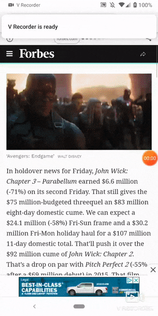

# dynamic-redirect

My smart TV at home has a browser, but it's painful to type a long URL by pointing and clicking on a remote control.

For the past months I've been using bit.ly to shortern the URL, but it's still painful to type `bit.ly/2EsgWub` every time.

Finally I decided to make an app to solve this first world problem.

## Demo
1. Config the url using the flutter app on your phone. (Or on firebase console on your laptop)

2. Go to https://dynamic-redirect-e0e7c.firebaseapp.com on your tv browser

3. Get redirected and enjoy the movie
